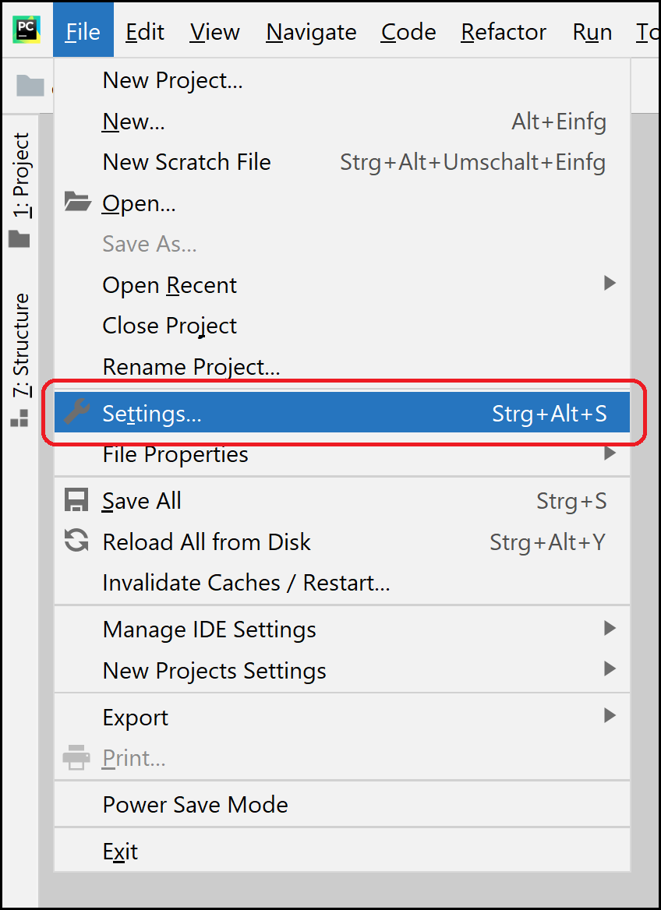
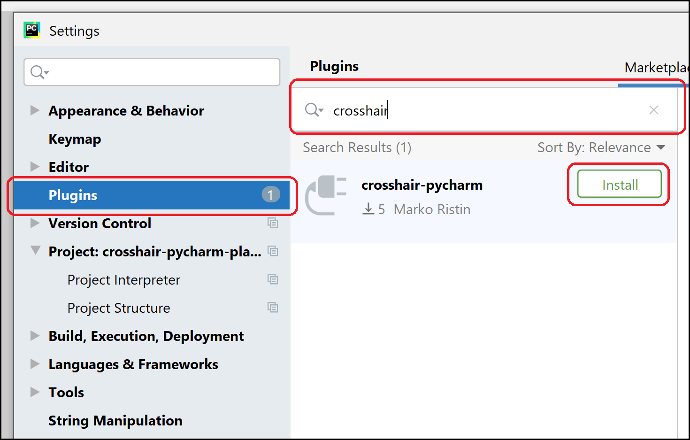
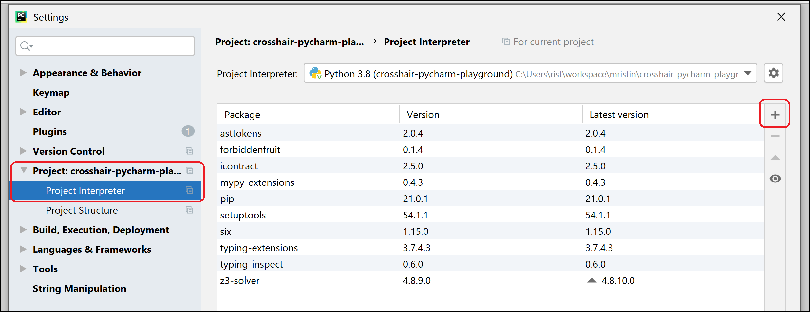
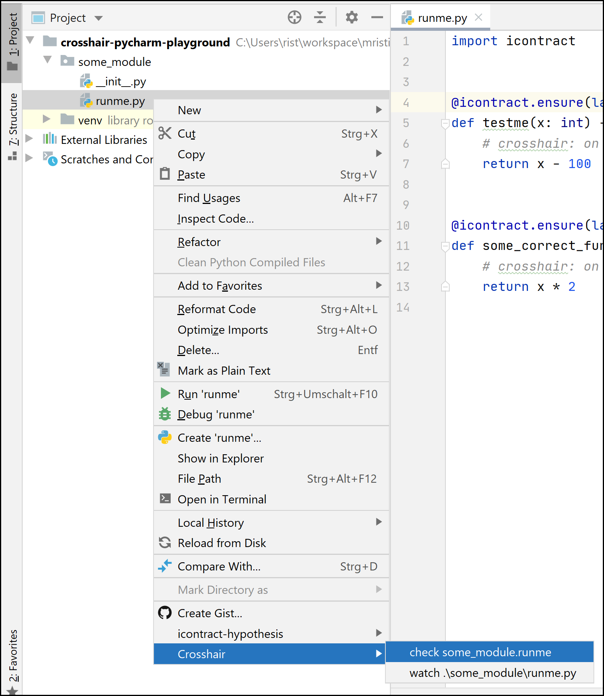
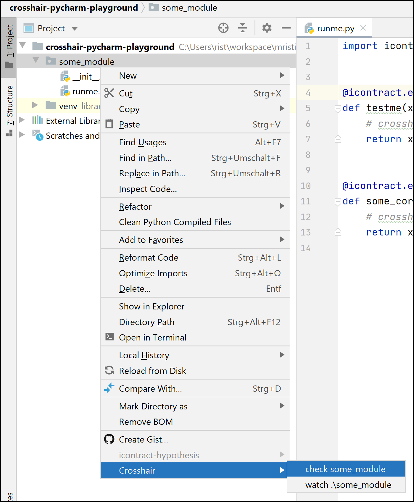

# crosshair-pycharm

Crosshair-pycharm is a plug-in for [PyCharm IDE] that
allows you to automatically test your Python code using
[crosshair-tool].

[PyCharm IDE]: https://www.jetbrains.com/pycharm/
[crosshair-tool]: https://pypi.org/project/crosshair-tool/

## Installation

**Install crosshair-pycharm**.
Use [Plug-in manager] in your PyCharm: File ⟶ Settings ⟶ Plugins.

[Plug-in manager]: https://www.jetbrains.com/help/pycharm/managing-plugins.html

Select `crosshair-pycharm`.

**Install crosshair-tool**.
As crosshair-pycharm is only a thin wrapper around [crosshair-tool], please install
[crosshair-tool] manually in the virtual environment of your project.

For example, through: File ⟶ Settings ⟶ Project ⟶ Python Interpreter.

If you are writing a package using [`setup.py`], you might want to include
[crosshair-tool] in [your test dependencies].

[`setup.py`]: https://packaging.python.org/tutorials/packaging-projects/
[your test dependencies]: https://stackoverflow.com/questions/15422527/best-practices-how-do-you-list-required-dependencies-in-your-setup-py

## Usage

You can use crosshair-pycharm from within an editor (with an open Python file) through
the editor pop-up menu:

Alternatively, you can select a file in the project view and access crosshair-pycharm
through the project view pop-up menu:

A module containing multiple submodules can also be selected in which case both 
the parent module, and the children modules are going to be verified (or in case of 
`watch` command, watched recursively):

You can also select a directory which is not a proper Python module (*e.g.*, lacks 
the `__init__.py`).
In this case, all the Python files beneath the directory will be verified.

### Actions

Crosshair-pycharm creates the run configuration based on the selected action (described
below).

You can view and edit these run configurations manually or re-run them (usually by 
pressing Shift+F10).
Crosshair-pycharm will *not* overwrite the run configurations, so the manual changes 
will persist.
For example, you might want to change the parameter ``--per_path_timeout`` in 
a particular run (see [Command-line interface] in the crosshair-tool's documentation).

[Command-line interface]: https://crosshair.readthedocs.io/en/latest/command-line_interface.html

The following actions can be executed:

**Check {module or function}**.
Verify the given module or function using [crosshair-tool].

**Watch {module or function}**.
Watch the given module or function for changes and verify continuously using 
[crosshair-tool].

You can see the results in the terminal window immediately upon making changes in 
the editor.

## Contributing

Feature requests or bug reports are always very, very welcome!

Please see quickly if the issue does not already exist in the
[issue section](https://github.com/mristin/crosshair-pycharm/issues) and, if not,
create [a new issue](https://github.com/mristin/crosshair-pycharm/issues/new).

You can also contribute in code.
Please use [GitHub's fork workflow](https://gist.github.com/Chaser324/ce0505fbed06b947d962).
The commit messages follow [Chris Beams' guidelines](https://chris.beams.io/posts/git-commit/).
Please discuss briefly the feature you would like to implement beforehand so that we can
explore together the use case and how it fits with the overall vision.

## Versioning

We follow a bit unusual semantic versioning schema:

* X is the oldest supported version of [crosshair-tool],
* Y is the minor version (new or modified features), and
* Z is the patch version (only bug fixes).
